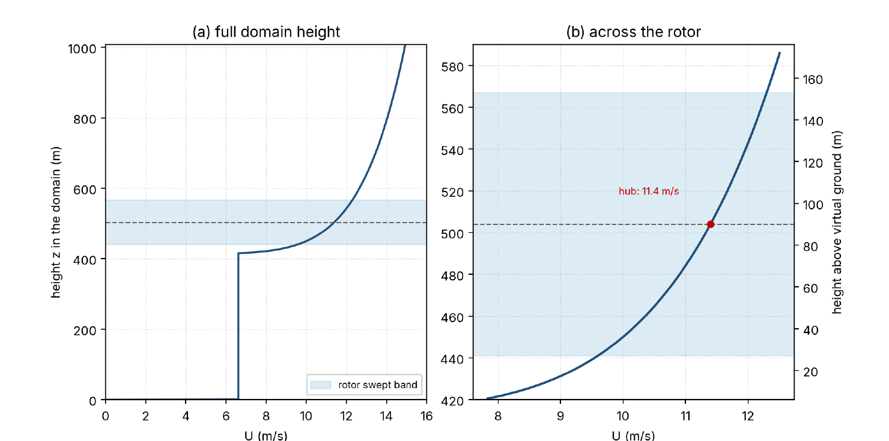

# NREL 5 MW in laminar sheared inflow

**S. Ouchene**  
**15.06.2026**

An NREL 5 MW rotor in a steady, sheared inflow with no turbulence. The flow comes from a PALM large-eddy simulation coupled to OpenFAST (AeroDyn 15), with the rotor represented by an actuator line. This short document explains the OpenFAST output files that come with it.

## 1. Inflow profile

The inflow is a power-law shear and is the same in every case. The flow is aligned with the streamwise (x) direction only; the lateral and vertical components are zero. The speed grows with height as

$$
U(z) = 11.4\left(\frac{z - 414}{90}\right)^{0.143}
$$

with reference speed 11.4 m/s at hub height and shear exponent 0.143. Here $z$ is the height in the PALM domain (m). The hub is at $z = 504$ m, which is 90 m above a virtual ground at $z = 414$ m, so the shear across the rotor matches a real turbine with a 90 m hub height instead of being measured from the domain floor. Below 2 m above the virtual ground the speed is held flat at 6.6145 m/s. The profile is fixed at the inlet and does not change in time. Figure 1 shows it: subfigure (a) over the full domain height, subfigure (b) zoomed on the rotor, where the speed runs from about 9.6 m/s at the bottom of the disk to 11.4 m/s at the hub and 12.3 m/s at the top.

*Figure 1. Imposed inflow $U(z)$. The shaded band is the rotor-swept height (441 to 567 m, i.e. hub +/- R). The dashed line is hub height (504 m, $U = 11.4$ m/s).*

## 2. Domain and turbine

The domain is a box, with rotor diameter $D = 126$ m and radius $R = 63$ m. The grid is uniform at 1.575 m in all three directions ($R/40$). Table 1 gives the extent, the grid spacing, and where the turbine sits.

*Table 1. Domain extent, grid spacing, and turbine position.*

| Direction | Extent | In diameters | Grid spacing | Turbine position |
|---|---:|---:|---|---|
| x, streamwise | 1260 m | 10 D | dx = 1.575 m | rotor 3 D from the inlet |
| y, lateral | 1008 m | 8 D | dy = 1.575 m | centred (4 D) |
| z, vertical | 1008 m | 8 D | dz = 1.575 m | hub at 4 D (504 m) |

The turbine stands 3 D (378 m) downstream of the inlet, centred across the domain, with the hub at mid-height (4 D = 504 m). That leaves 3 D of clear inflow upstream and 7 D of space for the wake downstream, and about 3.5 D from the rotor edge to each side wall and to the top and bottom. Table 2 lists the rotor geometry and the operating point.

*Table 2. Rotor geometry and operating point.*

| Property | Value |
|---|---|
| Turbine | NREL 5 MW |
| Number of blades | 3 |
| Rotor diameter, D | 126 m |
| Rotor radius, R (TipRad) | 63 m |
| Hub radius | 1.5 m |
| Hub height | 504 m (4 D) |
| Precone angle | 0 deg (all 3 blades, not coned) |
| Shaft tilt angle | 0 deg |
| Overhang | -5.02 m (rotor upwind of the tower) |
| Rotor speed | 12.1 rpm, fixed (clockwise rotation) |
| Blade pitch | 0 deg, fixed |
| Nacelle yaw | 0 deg |
| Structural degrees of freedom | all off (rigid) |

All ElastoDyn structural degrees of freedom are off, so the turbine is rigid: the blades and tower do not bend, the deflection channels stay near zero, and the load channels report the reaction forces and moments.

## 3. Cases

Two things change from case to case. Everything else (inflow, domain, time step, turbine) is the same.

1. **Force smearing width (epsilon)**, used by the actuator-line method to spread the blade forces onto the grid. It is set through `reg_fac = epsilon / dx` with `dx = 1.575 m`, so `reg_fac` of 2, 3, 4, 5 gives epsilon of 3.15, 4.725, 6.3, 7.875 m.
2. **Near-wake correction**, either on or off.

The near-wake correction accounts for the effect of the force smearing itself on the induced velocity; if that is confusing, you can simply ignore the four `nwc` cases and use only the four `no_nwc` ones.

That makes 4 x 2 = 8 cases. The case name is in each file name.

| Case (name tag) | `reg_fac` | epsilon (m) | Near-wake correction |
|---|---:|---:|---|
| `nrel5mw_laminar_shear_eps2_nwc` | 2 | 3.15 | on |
| `nrel5mw_laminar_shear_eps3_nwc` | 3 | 4.725 | on |
| `nrel5mw_laminar_shear_eps4_nwc` | 4 | 6.3 | on |
| `nrel5mw_laminar_shear_eps5_nwc` | 5 | 7.875 | on |
| `nrel5mw_laminar_shear_eps2_no_nwc` | 2 | 3.15 | off |
| `nrel5mw_laminar_shear_eps3_no_nwc` | 3 | 4.725 | off |
| `nrel5mw_laminar_shear_eps4_no_nwc` | 4 | 6.3 | off |
| `nrel5mw_laminar_shear_eps5_no_nwc` | 5 | 7.875 | off |

## 4. The `.out` files and their columns

Each `.out` file is plain text. It starts with a few header lines (run information), then two rows: the channel names and their units. After that come the data rows, one per time step, tab separated. The first column is `Time` (s). Output is written every step (`DT = 0.015625 s`, that is 1/64 s) and each run covers about 295 s of simulated time.

The remaining columns are OpenFAST output channels, in this order: first the structural channels from ElastoDyn, then the aerodynamic channels from AeroDyn (the rotor totals, then the per blade-node values). The tables below describe the rotor, shaft, blade and aerodynamic channels. The file also has tower-base and yaw-bearing load channels, which are not covered here. A note on sign and coordinate systems: `c` is the coned blade system, `b` is the blade system, `h` is the rotor hub system.

> **Note.** Ignore the initial startup transient. Each run is 295 s long; for steady values, average over the last 20 rotor revolutions.

### 4.1 Rotor, shaft and nacelle (ElastoDyn)

| Channel | Units | Meaning |
|---|---|---|
| `RotSpeed` | rpm | Rotor speed (low-speed shaft). Fixed at 12.1 rpm here. |
| `GenSpeed` | rpm | Generator speed (high-speed shaft). |
| `Azimuth` | deg | Blade 1 azimuth angle. |
| `BldPitch1` | deg | Blade 1 pitch angle. Fixed at 0 here. |
| `YawPos` | deg | Nacelle yaw angle. Fixed at 0 here. |
| `RotThrust` | kN | Rotor thrust along the shaft axis. |
| `RotTorq` | kN-m | Rotor torque on the low-speed shaft. Listed twice in the setup, so it may appear as two identical columns. |
| `RotPwr` | kW | Rotor mechanical power. |
| `LSSGagMya`, `LSSGagMza` | kN-m | Low-speed-shaft bending moment at the main bearing, two perpendicular directions. |

### 4.2 Blade 1 loads and deflections (ElastoDyn)

| Channel | Units | Meaning |
|---|---|---|
| `RootFxc1`, `RootFyc1`, `RootFzc1` | kN | Blade 1 root forces: out-of-plane shear, in-plane shear, axial (coned system). |
| `RootMxc1`, `RootMyc1`, `RootMzc1` | kN-m | Blade 1 root moments: in-plane bending, out-of-plane bending, pitching (coned system). |
| `RootMxb1`, `RootMyb1` | kN-m | Blade 1 root bending moments in the blade system: edgewise (xb), flapwise (yb). |
| `Spn2MLxb1`, `Spn2MLyb1` | kN-m | Blade 1 local bending moments (edgewise, flapwise) at blade strain-gage station 2, which is ElastoDyn blade node 9 of 62, near r/R = 0.16 (low on the blade, not mid-span). |
| `OoPDefl1`, `IPDefl1` | m | Blade 1 tip out-of-plane and in-plane deflection. Near zero (rigid blades). |
| `TwstDefl1` | deg | Blade 1 tip twist deflection. Near zero (rigid blades). |

### 4.3 Rotor aerodynamic totals (AeroDyn)

These are AeroDyn's integrated loads on the whole rotor, in the hub system (`h`). Note the units: AeroDyn reports these in N, N-m and W, while the ElastoDyn rotor loads above are in kN, kN-m and kW.

| Channel | Units | Meaning |
|---|---|---|
| `RtAeroFxh` | N | Rotor aerodynamic force along the hub x axis: the aerodynamic thrust. |
| `RtAeroFyh`, `RtAeroFzh` | N | Rotor aerodynamic force, hub y and z axes. |
| `RtAeroMxh` | N-m | Rotor aerodynamic moment about the hub x axis: the aerodynamic torque. |
| `RtAeroMyh`, `RtAeroMzh` | N-m | Rotor aerodynamic moment, hub y and z axes. |
| `RtAeroPwr` | W | Rotor aerodynamic power. |
| `RtArea` | m^2 | Rotor swept area (constant). |

### 4.4 Per blade-node aerodynamics (AeroDyn)

These are written for every blade node, on all 3 blades, at all 64 nodes. A channel is named `AB<b>N<nnn><name>`: blade `b` (1 to 3), node `nnn` (001 to 064, from root to tip), then the quantity. For example, `AB2N017Alpha` is the angle of attack at blade 2, node 17. That is 3 x 64 x 8 = 1536 columns.

| Channel | Units | Meaning |
|---|---|---|
| `...Alpha` | deg | Angle of attack at the section. |
| `...Cl` | - | Lift coefficient. |
| `...Cd` | - | Drag coefficient. |
| `...Vrel` | m/s | Relative flow speed at the section. |
| `...Fx` | N/m | Force per unit length normal to the rotor plane (out of plane). |
| `...Fy` | N/m | Force per unit length tangential to the rotor plane (in plane). |
| `...DynP` | Pa | Dynamic pressure, 0.5 rho Vrel^2. |
| `...Theta` | deg | Section angle: blade pitch plus local twist. |

The per-node blade geometry is fixed (the same in every case) and is not in the output file. Table 3 lists it for each node: the radius (`r/R` and `r`, with `r` from the rotor centre and `R = 63 m`), the chord, the aerodynamic twist, and the airfoil. Node 1 is nearest the root, node 64 the tip.

*Table 3. Per-node blade geometry: radius, chord, twist, and airfoil (root to tip).*

| Node | r/R | r (m) | Chord (m) | Twist (deg) | Airfoil |
|---:|---:|---:|---:|---:|---|
| 1 | 0.024 | 1.50 | 3.542 | 13.308 | Cylinder1 |
| 2 | 0.039 | 2.48 | 3.542 | 13.308 | Cylinder1 |
| 3 | 0.055 | 3.45 | 3.609 | 13.308 | Cylinder1 |
| 4 | 0.070 | 4.43 | 3.720 | 13.308 | Cylinder1 |
| 5 | 0.086 | 5.40 | 3.832 | 13.308 | Cylinder1 |
| 6 | 0.101 | 6.38 | 3.943 | 13.308 | Cylinder1 |
| 7 | 0.117 | 7.36 | 4.055 | 13.308 | Cylinder2 |
| 8 | 0.132 | 8.33 | 4.167 | 13.308 | Cylinder2 |
| 9 | 0.148 | 9.31 | 4.278 | 13.308 | Cylinder2 |
| 10 | 0.163 | 10.29 | 4.390 | 13.308 | DU40_A17 |
| 11 | 0.179 | 11.26 | 4.501 | 13.308 | DU40_A17 |
| 12 | 0.194 | 12.24 | 4.568 | 13.090 | DU40_A17 |
| 13 | 0.210 | 13.21 | 4.591 | 12.655 | DU40_A17 |
| 14 | 0.225 | 14.19 | 4.614 | 12.220 | DU35_A17 |
| 15 | 0.241 | 15.17 | 4.636 | 11.785 | DU35_A17 |
| 16 | 0.256 | 16.14 | 4.638 | 11.386 | DU35_A17 |
| 17 | 0.272 | 17.12 | 4.592 | 11.072 | DU35_A17 |
| 18 | 0.287 | 18.10 | 4.546 | 10.758 | DU35_A17 |
| 19 | 0.303 | 19.07 | 4.500 | 10.444 | DU35_A17 |
| 20 | 0.318 | 20.05 | 4.453 | 10.135 | DU35_A17 |
| 21 | 0.334 | 21.02 | 4.403 | 9.861 | DU35_A17 |
| 22 | 0.349 | 22.00 | 4.354 | 9.587 | DU35_A17 |
| 23 | 0.365 | 22.98 | 4.304 | 9.312 | DU30_A17 |
| 24 | 0.380 | 23.95 | 4.254 | 9.038 | DU30_A17 |
| 25 | 0.396 | 24.93 | 4.197 | 8.750 | DU30_A17 |
| 26 | 0.411 | 25.90 | 4.140 | 8.461 | DU30_A17 |
| 27 | 0.427 | 26.88 | 4.082 | 8.171 | DU25_A17 |
| 28 | 0.442 | 27.86 | 4.024 | 7.882 | DU25_A17 |
| 29 | 0.458 | 28.83 | 3.964 | 7.587 | DU25_A17 |
| 30 | 0.473 | 29.81 | 3.902 | 7.289 | DU25_A17 |
| 31 | 0.489 | 30.79 | 3.841 | 6.991 | DU25_A17 |
| 32 | 0.504 | 31.76 | 3.779 | 6.693 | DU25_A17 |
| 33 | 0.520 | 32.74 | 3.719 | 6.403 | DU25_A17 |
| 34 | 0.535 | 33.71 | 3.660 | 6.122 | DU25_A17 |
| 35 | 0.551 | 34.69 | 3.602 | 5.840 | DU21_A17 |
| 36 | 0.566 | 35.67 | 3.543 | 5.558 | DU21_A17 |
| 37 | 0.582 | 36.64 | 3.484 | 5.277 | DU21_A17 |
| 38 | 0.597 | 37.62 | 3.426 | 4.998 | DU21_A17 |
| 39 | 0.613 | 38.60 | 3.367 | 4.719 | DU21_A17 |
| 40 | 0.628 | 39.57 | 3.309 | 4.439 | DU21_A17 |
| 41 | 0.644 | 40.55 | 3.250 | 4.163 | DU21_A17 |
| 42 | 0.659 | 41.52 | 3.192 | 3.910 | DU21_A17 |
| 43 | 0.675 | 42.50 | 3.133 | 3.657 | DU21_A17 |
| 44 | 0.690 | 43.48 | 3.074 | 3.403 | NACA64_A17 |
| 45 | 0.706 | 44.45 | 3.016 | 3.150 | NACA64_A17 |
| 46 | 0.721 | 45.43 | 2.957 | 2.952 | NACA64_A17 |
| 47 | 0.737 | 46.40 | 2.899 | 2.760 | NACA64_A17 |
| 48 | 0.752 | 47.38 | 2.840 | 2.568 | NACA64_A17 |
| 49 | 0.768 | 48.36 | 2.782 | 2.377 | NACA64_A17 |
| 50 | 0.783 | 49.33 | 2.723 | 2.187 | NACA64_A17 |
| 51 | 0.799 | 50.31 | 2.664 | 1.998 | NACA64_A17 |
| 52 | 0.814 | 51.29 | 2.606 | 1.809 | NACA64_A17 |
| 53 | 0.830 | 52.26 | 2.547 | 1.620 | NACA64_A17 |
| 54 | 0.845 | 53.24 | 2.489 | 1.431 | NACA64_A17 |
| 55 | 0.861 | 54.21 | 2.430 | 1.242 | NACA64_A17 |
| 56 | 0.876 | 55.19 | 2.372 | 1.052 | NACA64_A17 |
| 57 | 0.892 | 56.17 | 2.313 | 0.863 | NACA64_A17 |
| 58 | 0.907 | 57.14 | 2.232 | 0.687 | NACA64_A17 |
| 59 | 0.923 | 58.12 | 2.151 | 0.511 | NACA64_A17 |
| 60 | 0.938 | 59.10 | 2.038 | 0.351 | NACA64_A17 |
| 61 | 0.954 | 60.07 | 1.800 | 0.257 | NACA64_A17 |
| 62 | 0.969 | 61.05 | 1.562 | 0.163 | NACA64_A17 |
| 63 | 0.985 | 62.02 | 1.324 | 0.001 | NACA64_A17 |
| 64 | 1.000 | 63.00 | 1.085 | -0.260 | NACA64_A17 |
